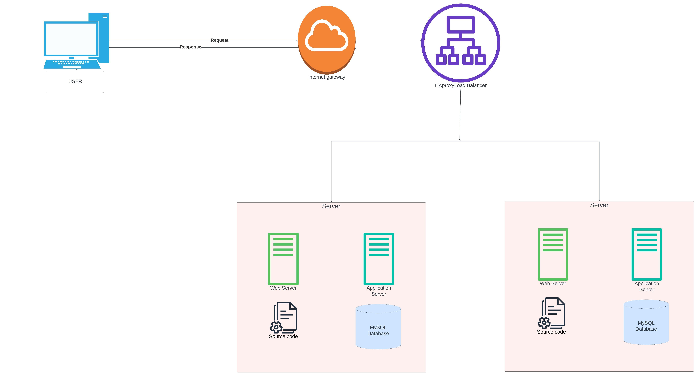

# Simple Web Stack

## Diagram

## Description

This diagram shows a simple web stack. It consists of a single server, a single web server, and a single database server.

## Components

1. 2 servers
2. 1 web server
3. 1 application server
4. 1 database server
5. Application code
6. 1 domain name `www.foobar.com`
7. 1 load-balancer (HAproxy)

## Questions

1. Reason for adding each element?
    * 2 servers - To avoid a single point of failure. If one server goes down, the other server can take over.
    * 1 load-balancer (HAproxy) - To distribute incoming traffic to the web servers. If one web server goes down, the other web server can take over.

2. Load-balancer distribution algorithm?
    * Round-robin - The load-balancer distributes incoming traffic to the web servers in a round-robin fashion. This means that the load-balancer will distribute incoming traffic to the first web server, then the second web server, then the first web server, then the second web server, and so on.

3. Active-Active or Active-Passive setup?
    * My web server is set up in an Active-Active setup.
    * Active-Active - Both web servers are actively serving traffic. If one web server goes down, the other web server can take over.
    * Active-Passive - Only one web server is actively serving traffic. If the active web server goes down, the passive web server can take over.

4. How does a database Primary-Replica (Master-Slave) cluster work?
    * A database Primary-Replica (Master-Slave) cluster works by having a primary database server and a replica database server. The primary database server is the main database server. The replica database server is a copy of the primary database server. The replica database server is used as a backup in case the primary database server goes down. The replica database server is also used to distribute incoming traffic to the database servers. This is done by having the replica database server serve read-only traffic and the primary database server serve read-write traffic.

5. What is the difference between the Primary node and the Replica node in regard to the application?
    * The primary node is the main node. It is the node that is actively serving traffic. The replica node is a copy of the primary node. It is used as a backup in case the primary node goes down.

## Issues with this infrastructure

1. Single Point of Failure
    * If the primary database server goes down, data will not be able to be written to the database.
    * If the load-balancer goes down or under maintenance, incoming traffic will not be able to be distributed to the web servers.

2. Security issues
    * The servers are not secured as they are not behind a firewall. This means that the servers are vulnerable to attacks. This means that the servers can be accessed by anyone who has access to the network.
    * No SSL (HTTPS) is used. This means that the data sent between the server and the user is not encrypted. This means that the data can be read by anyone who has access to the network.

3. No monitoring
    * There is no monitoring set up. This means that there is no way to know if the servers are up or down. This means that there is no way to know if the servers are under attack or need maintenance.
