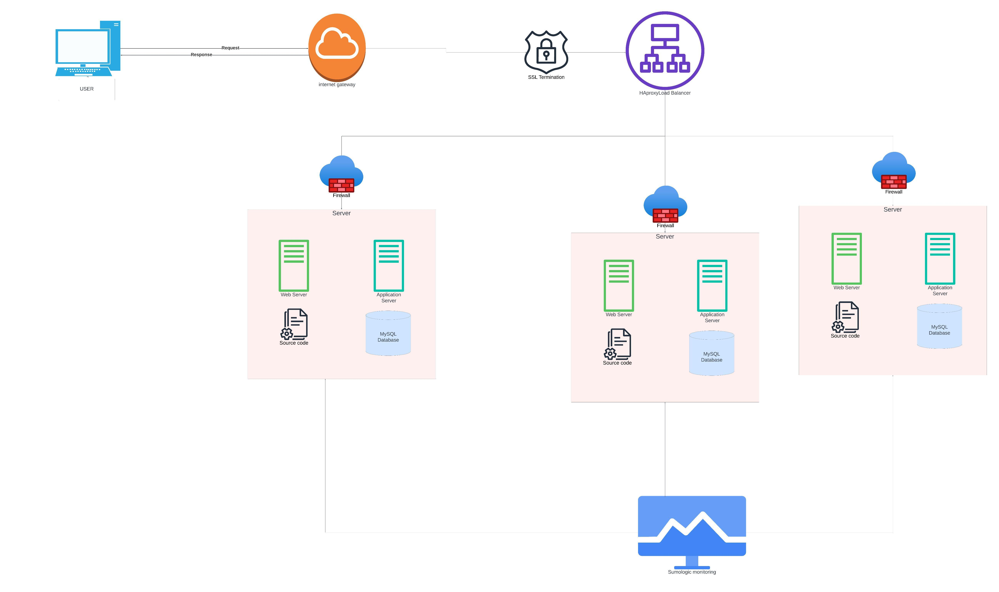

# Simple Web Stack

## Diagram

## Description

This diagram shows a simple web stack. It consists of a single server, a single web server, and a single database server.

## Components

1. 3 servers
2. 1 web server
3. 1 application server
4. 1 database server
5. Application code
6. 1 domain name `www.foobar.com`
7. 1 load-balancer (HAproxy)
8. 1 firewall
9. 1 SSL certificate
10. 1 monitoring client

This infrastructure comprises three web servers that are equipped with security measures, monitoring capabilities, and the ability to handle encrypted data traffic.

## Questions

1. Reason for adding each element?
    * 3 servers - To avoid a single point of failure. If one server goes down, the other server can take over.
    * 1 load-balancer (HAproxy) - To distribute incoming traffic to the web servers. If one web server goes down, the other web server can take over.
    * 1 firewall - To protect the web servers from unauthorized access. If the firewall is not present, the web servers are vulnerable to attacks.
    * 1 SSL certificate - To encrypt the data sent between the server and the user. If the SSL certificate is not present, the data sent between the server and the user is not encrypted. This means that the data can be read by anyone who has access to the network.
    * 1 monitoring client - To monitor the web servers. If the monitoring client is not present, there is no way to know if the web servers are up or down. This means that there is no way to know if the web servers are under attack or need maintenance.

2. What are firewalls for?
Firewalls serve the purpose of safeguarding the web servers by acting as intermediaries between the internal and external networks. They prevent unwanted or unauthorized users by blocking incoming traffic that meets specific criteria.

3. Why is the traffic served over HTTPS?
SSL certificates are used to secure the data exchange between the web servers and the external network, guarding against potential threats such as man-in-the-middle attacks and network sniffing, which could expose sensitive information. These certificates ensure confidentiality, integrity, and authentication/ authorization.

4. What monitoring is used for?
Monitoring clients are responsible for overseeing the performance and functionality of the servers and the external network. They assess server health, promptly alert administrators if any anomalies arise, and show key operational metrics. This monitoring tool continuously evaluates server accessibility, response times, and detects errors, such as missing or corrupted files, security breaches, and other potential issues.

## Issues With This Infrastructure

1. Implementing SSL termination at the load balancer level would mean that the data exchanged between the load balancer and the web servers would remain unencrypted.
2. The presence of a single MySQL server poses scalability challenges and creates a potential single point of failure within the web infrastructure. If the primary database server goes down, data will not be able to be written to the database.
3. When all servers utilize identical components, resource contention for CPU, memory, and I/O can lead to performance degradation and complicate issue diagnosis. Such a configuration is not readily scalable.
